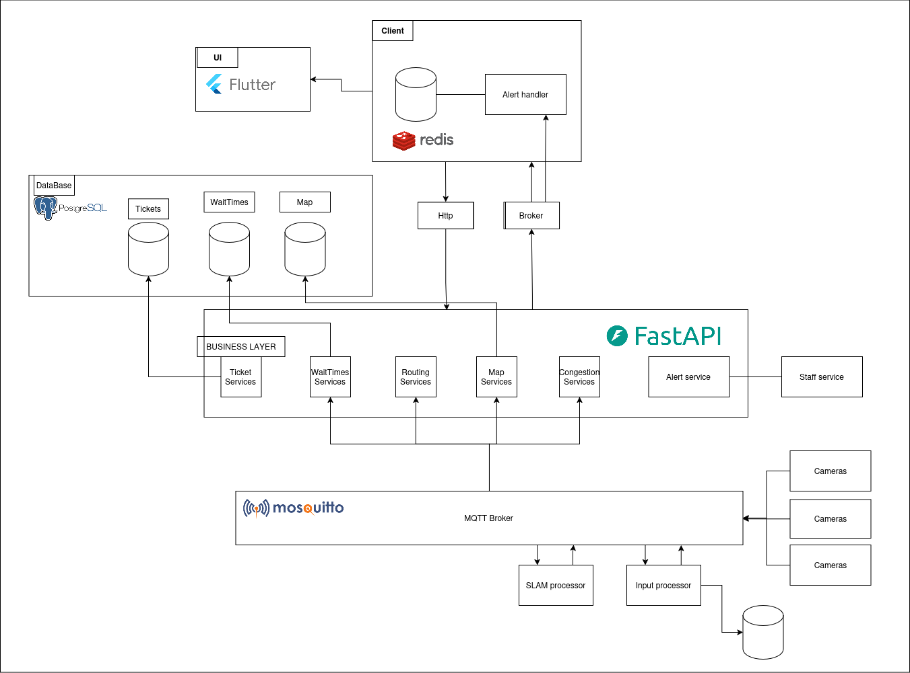

# Architecture

The diagram below presents the high-level system architecture for our stadium fan application.
It illustrates the main components, technologies, and data flows involved in delivering core functionalities such as queue monitoring, ticketing, navigation, and real-time alerts.
Key elements include the client UI (built with Flutter), backend services (powered by FastAPI), data storage (PostgreSQL and Redis), and integration with external systems like cameras and staff services via MQTT (Mosquitto) for real-time processing.
This architecture ensures scalability, responsiveness, and seamless interaction between users and the stadium infrastructure.

