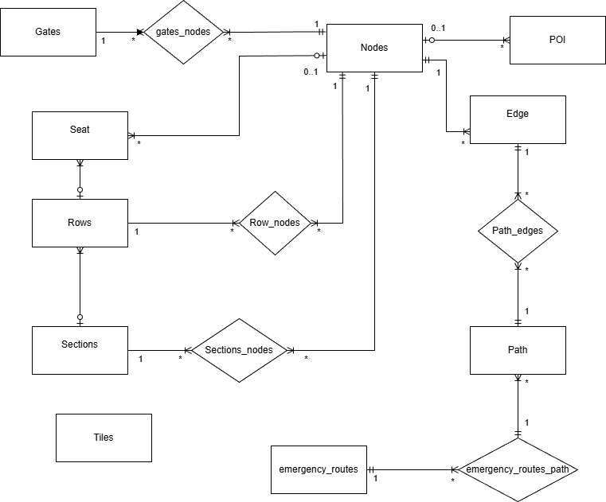
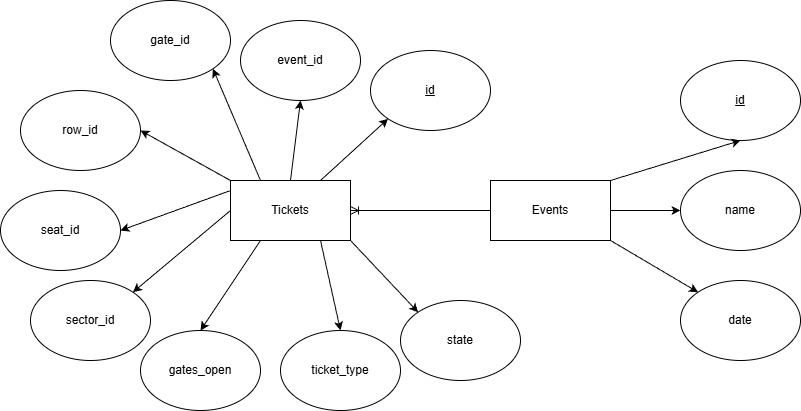

# Database

This page presents the database design for the stadium fan application. The diagrams below illustrate how key data entities—such as maps, seating, tickets, and events are structured and related within the system.

## Map Database Diagram

This ER diagram models the stadium’s physical layout. It includes entities for gates, nodes (locations), points of interest (POI), seats, rows, sections, and paths.

## Ticket Database Diagram

This ER diagram focuses on ticketing and event management. The central entity is Tickets, which links to attributes such as seat, row, sector, gate, and event. The diagram also shows the relationship between tickets and events, capturing details like event name and date, as well as ticket-specific information such as type, state, and gate access.

