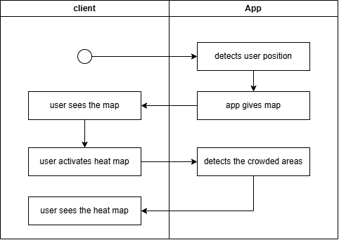
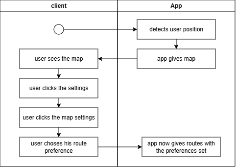
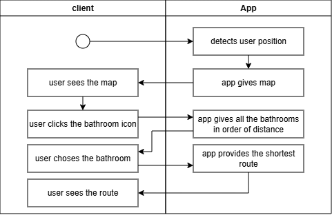
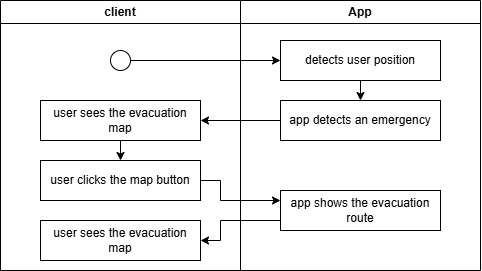

# Workflows

The following diagrams illustrate key user workflows within the stadium fan application. Each workflow demonstrates the step-by-step interaction between the client (user) and the app, highlighting how core features are accessed and utilized to enhance the stadium experience.

## Crowd Congestion Workflow

This workflow shows how a user can view a heat map of crowded areas in the stadium. The app detects the user’s position, provides the map, and, upon activation, displays real-time crowd density to help users avoid congested zones.

## Routing Preference Workflow

Here, the user customizes their route preferences through the app’s settings. After the app detects the user’s position and provides the map, the user can set preferences (e.g., shortest, least crowded route), and the app generates routes tailored to those choices.

## Navigation Workflow

This workflow guides the user to the nearest bathroom. The app detects the user’s position, provides a map, lists bathrooms by distance, and then offers the shortest route to the selected bathroom, improving convenience and reducing wait times.

## Emergency Workflow

In case of an emergency, this workflow shows how the app assists users in evacuating safely. After detecting the user’s position and an emergency, the app displays the evacuation map and route, ensuring users can quickly find the safest exit.

