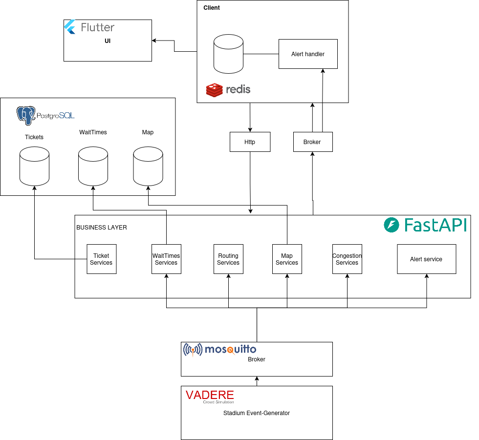

# Architecture Review

Due to the lack of a real stadium-like environmet with the required technologies to test our system, some adjustments had to be made to the architecture.

Instead of using cameras and data processing modules, we needed to simulate the data that would be collected in a real scenario. This was done through an event generator that mimics the behavior of a real stadium environment. The technology we used for the event generator is the Vadere simulator, which allows us to create various scenarios and generate events based on predefined parameters.

