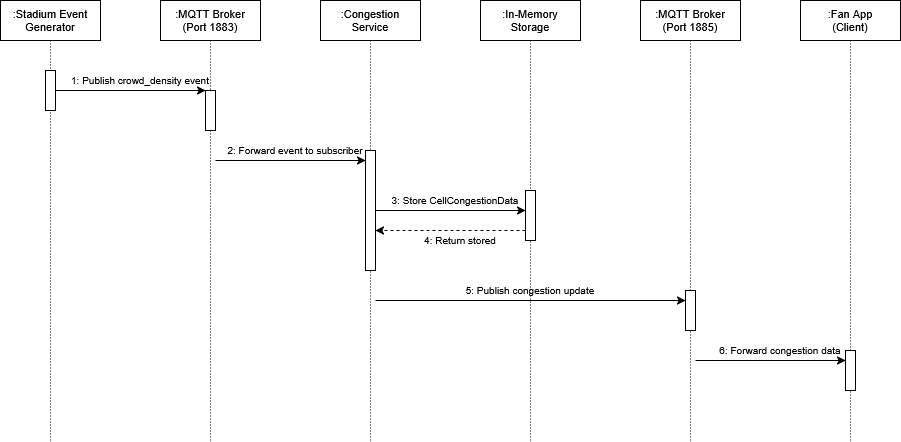
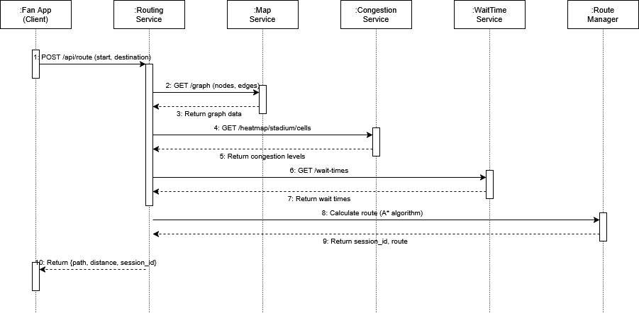
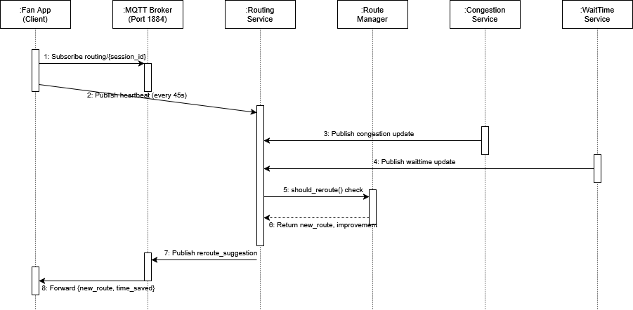
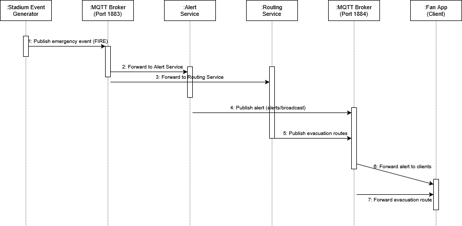

# System Workflow Diagrams

This section presents sequence diagrams illustrating the core workflows of the *Estádio do Dragão FanApp* ecosystem.

---

## Crowd Congestion Workflow

**Explanation:**
This workflow shows how real-time crowd density information is propagated from the simulation layer to the mobile client:
1. The Stadium Event Generator publishes a `crowd_density` event to the MQTT Broker (Port 1883).
2. The MQTT Broker forwards the event to the subscribed Congestion Service.
3. The Congestion Service stores the `CellCongestionData` in In-Memory Storage.
4. In-Memory Storage confirms the data was stored.
5. The Congestion Service publishes a congestion update to the Client MQTT Broker (Port 1885).
6. The Client Broker forwards the congestion data to the Fan App.

---

## Routing Preference Workflow

**Explanation:**
This workflow illustrates the process of calculating an optimal route from a user's position to a selected destination:
1. The Fan App sends a `POST /api/route` request with start and destination.
2. The Routing Service queries the Map Service via `GET /graph (nodes, edges)`.
3. The Map Service returns graph data.
4. The Routing Service queries the Congestion Service via `GET /heatmap/stadium/cells`.
5. The Congestion Service returns current congestion levels.
6. The Routing Service queries the WaitTime Service via `GET /wait-times`.
7. The WaitTime Service returns wait times.
8. The Route Manager calculates the route using the A* algorithm.
9. The Route Manager returns the session_id and route.
10. The Routing Service returns the path, distance, and session_id to the Fan App.

---

## Navigation Workflow

**Explanation:**
This workflow describes the real-time interaction during active navigation, including dynamic re-routing:
1. The Fan App subscribes to `routing/{session_id}` via the MQTT Broker (Port 1884).
2. The Fan App publishes heartbeat messages every 45 seconds.
3. The Congestion Service publishes a congestion update.
4. The WaitTime Service publishes a wait-time update.
5. The Route Manager invokes `should_reroute()` to evaluate route conditions.
6. The Route Manager returns the new route and improvement percentage.
7. The Routing Service publishes the `reroute_suggestion`.
8. The MQTT Broker forwards the new route and time saved to the Fan App.

---

## Emergency Workflow

**Explanation:**
This workflow documents the critical path from emergency detection to evacuation route delivery:
1. The Stadium Event Generator publishes an emergency event (e.g., FIRE) to the MQTT Broker (Port 1883).
2. The MQTT Broker forwards the event to the Alert Service.
3. The MQTT Broker forwards the event to the Routing Service.
4. The Alert Service publishes an alert via `alerts/broadcast` on the Client Broker (Port 1884).
5. The Routing Service publishes evacuation routes for active sessions.
6. The Client Broker forwards the alert to connected clients.
7. The Client Broker forwards the evacuation route to the Fan App.

---

