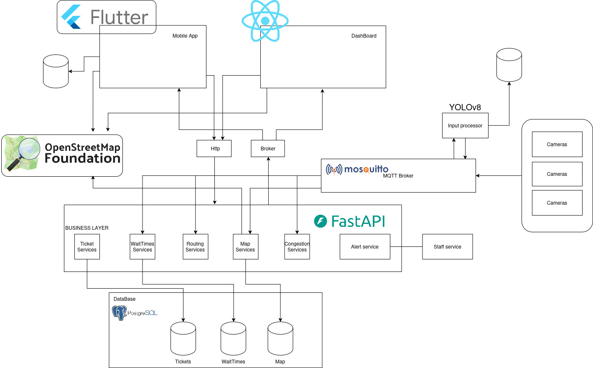

# Project Scope Changes

## General Changes

Due to a lack of resources to continue our project in an indoor stadium-like environment (no bluetooth low energy beacons, and ESP32's being a bad solution), our team decided to change the project scope to an outdoor setting on the University of Aveiro campus, using GPS-based navigation.

Since we will no longer be able to use cameras with embedded NPUs, since they can't be installed througout the whole campus, we will generate heat maps using the location data from each app user instead.

## Node Editing Dashboard

Due to the new campus map we decided to make a dashboard with the aim to edit the campus nodes, or other maps that might use our service, this way the service administrators can manage the map and make improvements/changes to the map quickly.

## Architecture Changes

Due to the project scope changes, some of our architecture had to be changed again

Because of this, the architecture shifts away from camera-based sensing and NPU processing toward using each app user’s GPS location to generate heat maps and support navigation on campus.
