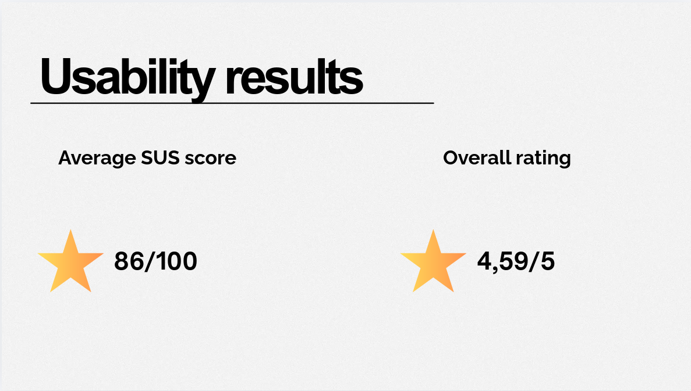
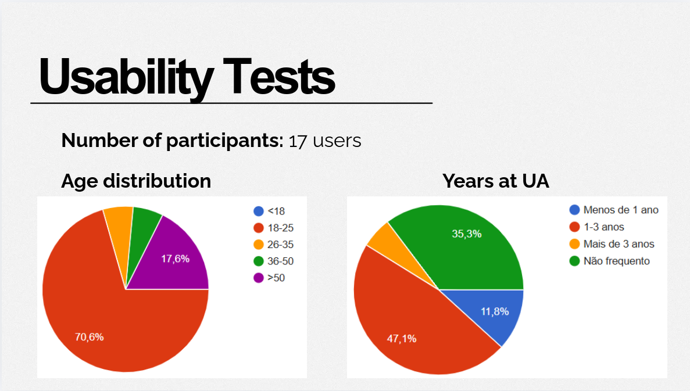

# Usability Testing

This section summarizes the usability tests carried out for the FanApp.  
For each task, we include the test question, what users were expected to do, and the observed outcome based on the collected results and charts.

## Usability Test Visual Results

## Task 1 - Simple Directions

**Question asked:**  
"You need to go to the Department of Electronics and Telecommunications (DETI). How would you get directions?"

**What was tested:**  
Whether users can quickly find and follow basic navigation directions to a known department.

**Result:**  
Based on 17 responses, this task was perceived as easy: 70.6% rated difficulty as 1, 23.5% as 2, and 5.9% as 3 (average difficulty: 1.35/5). These results indicate that users can obtain directions with minimal friction.

## Task 2 - Waiting Times

**Question asked:**  
"You want to have lunch at Cantina de Santiago, but you only have 30 minutes. How would you check if there is a long queue and the best time to go?"

**What was tested:**  
Whether users can access waiting-time information and use it to make a quick decision.

**Result:**  
From 17 responses, 58.8% rated this task as 1, 23.5% as 2, 11.8% as 3, and 5.9% as 4 (average difficulty: 1.65/5). The feature was still considered easy overall, but this is one of the tasks with higher perceived effort. Qualitative feedback highlighted the usefulness of seeing both travel time and queue waiting time.

## Task 3 - Filter Canteens

**Question asked:**  
"You need to find all canteens on campus."

**What was tested:**  
Whether users can discover and apply filters to list only canteens.

**Result:**  
For this task, 70.6% rated difficulty as 1 and 29.4% as 2 (17 responses; average difficulty: 1.29/5). Users generally completed it successfully, but some comments suggest that a few participants initially expected this action to be part of search.

## Task 4 - Accessibility Activation

**Question asked:**  
"You cannot use stairs. How would you configure the app to receive accessible routes?"

**What was tested:**  
Whether users can find and activate accessibility settings and understand their impact on routing.

**Result:**  
This task showed a wider spread: 47.1% rated difficulty as 1, 41.2% as 2, and 11.8% as 3 (17 responses; average difficulty: 1.65/5). While users completed it, comments indicate discoverability issues (for example, some users did not immediately know where to click).

## Task 5 - Search Bar

**Question asked:**  
"You want to find the Department of Communication and Art and navigate there. How would you do it?"

**What was tested:**  
Whether users can use the search bar to find a destination and immediately start navigation.

**Result:**  
Results were very positive: 76.5% rated difficulty as 1 and 23.5% as 2 (17 responses; average difficulty: 1.24/5). Participants found this flow straightforward and similar in simplicity to basic directions.

## Task 6 - Favorites

**Question asked:**  
"You want to save a department so you can find it easily later. How would you add it to favorites? Then remove it."

**What was tested:**  
Whether users can add and remove locations from favorites without confusion.

**Result:**  
This was one of the easiest tasks: 88.2% rated difficulty as 1, 5.9% as 2, and 5.9% as 3 (17 responses; average difficulty: 1.18/5). Users were able to add and remove favorites with very low effort.

## Task 7 - Heat Map

**Question asked:**  
"You want to see on the map which campus areas have the highest occupancy."

**What was tested:**  
Whether users can access and interpret occupancy intensity through the heat map view.

**Result:**  
Perceived difficulty remained low: 58.8% rated it as 1, 23.5% as 2, and 17.6% as 3 (17 responses; average difficulty: 1.59/5). Most users understood the occupancy visualization, although this task required slightly more interpretation than search or favorites.

## Task 8 - Alert

**Question asked:**  
"You received an alert in the app about a campus area. What do you do?"

**What was tested:**  
Whether users notice alerts and take the expected action (open, read, and react).

**Result:**  
The alert task was also easy overall: 64.7% rated difficulty as 1, 29.4% as 2, and 5.9% as 3 (17 responses; average difficulty: 1.41/5). Users generally understood what to do after receiving an alert, although feedback suggests alert wording can be made more explicit to avoid unnecessary concern.

## Overall Conclusion

Across all 8 tasks (136 total difficulty ratings), the overall average perceived difficulty was 1.42/5, indicating a low effort level for users.  
The easiest interaction was **Task 6 - Favorites** (1.18/5), followed by **Task 5 - Search Bar** (1.24/5) and **Task 3 - Filter Canteens** (1.29/5).  
The comparatively more demanding tasks were **Task 2 - Waiting Times** and **Task 4 - Accessibility Activation** (both 1.65/5), mainly due to discoverability and interpretation steps.  
Overall, the results confirm good usability, with clear opportunities to improve visibility of accessibility controls, filtering entry points, and alert message clarity.

