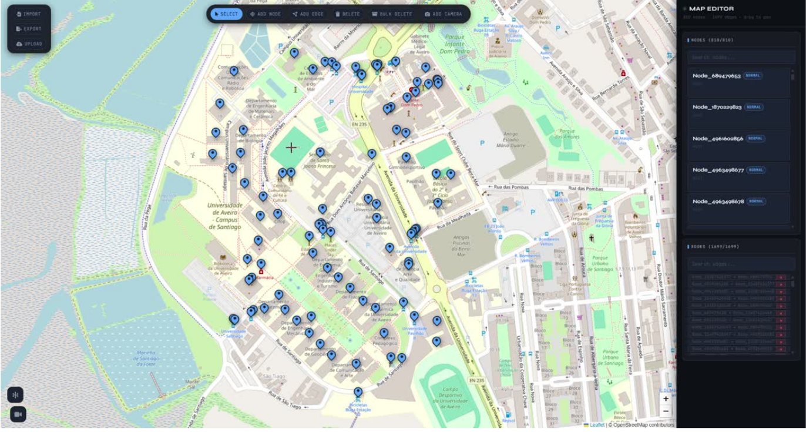
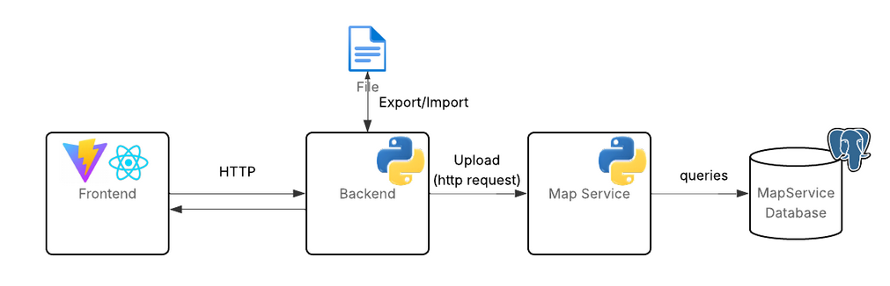

# Dashboard

The dashboard was introduced as part of the project scope change from an indoor stadium solution to an outdoor campus-based system. Since the app now relies on GPS navigation and user-generated location data, we needed a management interface to maintain the map structure used by the service.

Its main purpose is to allow administrators to edit campus nodes and keep the map data organized. This makes it easier to update routes, adjust points of interest, and apply future changes without needing to modify the application manually every time.

In practice, the dashboard supports maintenance and scalability. It is useful not only for the University of Aveiro campus, but also for any other map that may later use the same service. By centralizing map editing, the system becomes faster to maintain and more flexible to evolve.
