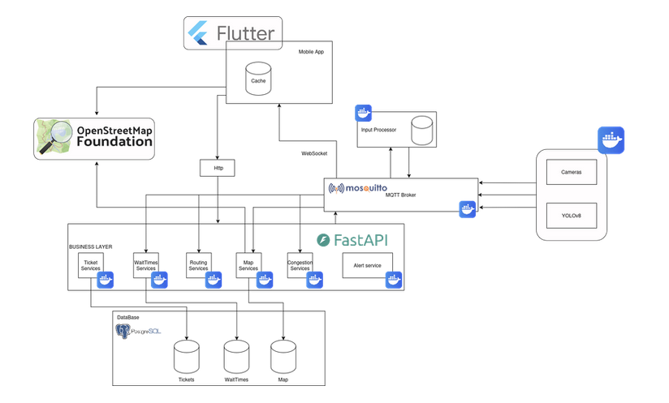

# Prototype Changes

## General Changes

In Milestone 5, we progressed from planning and usability testing to fully implementing the functional prototype of both the **Graph Editing Dashboard** and the **Fanapp** (under the unified system named RUA - Routing UA). The system has transitioned from a theoretical layout into a concrete, interactive application tailored for the University of Aveiro campus.

## Graph Editing Dashboard Implementation

To fully support the campus-based navigation service and handle changes in campus ground layouts or specific events, we implemented a dedicated **Graph Editing Dashboard**. 
- **The Need**: Service hosts require an intuitive interface to manage and adapt map nodes without manual code changes or direct database manipulations.
- **Features Implemented**: 
  - Selecting, adding, editing, and deleting individual map nodes (POIs, intersections).
  - Adding and deleting edges (paths) to define walkable routes.
  - Bulk deletion tools to save time when major map restructures occur.
  - Filtering paths and importing/exporting node configurations.
  - Direct database upload to easily deploy updated maps into the Map Service database.

## Fanapp Features & Usability Enhancements

Based on the usability feedback gathered during Milestone 4 (where 17 users participated, yielding a strong System Usability Scale score of 86/100 and an average difficulty score of 1.4/5 across actions), we refined several mobile application features:
- **Wait-Times Service Integration**: Implemented a fully functional queue-detection system. It processes loop recordings of service queues using computer vision, counts the people waiting, and translates this count into accurate real-time queue wait-time estimations (modeled via M/M/1 queuing theory).
- **Routing & Re-routing Optimizations**: Improved the Routing Service calculation times to allow instant route generation and quick automatic re-routing when a user leaves their designated path.
- **Accessibility Integration**: Completed the step-free accessibility route toggle, ensuring users with limited mobility or wheelchairs are routed strictly through paths without stairs.
- **UI Polishing**: Made minor visual adjustments to the map UI, search bar, POI filters, favorites, and emergency evacuation alerts to streamline visual responsiveness and language adaptation (English/Portuguese).

## Architecture & Technical Progress

The architectural design was updated to support the twin-flow system:
1. **The Administrator Flow**: Connecting the Dashboard frontend to the central Map-Service to modify and update map coordinates in real-time.
2. **The User Flow**: Connecting the Flutter Fanapp to the Map, Routing, Wait-Time, Congestion, and Alert microservices.

